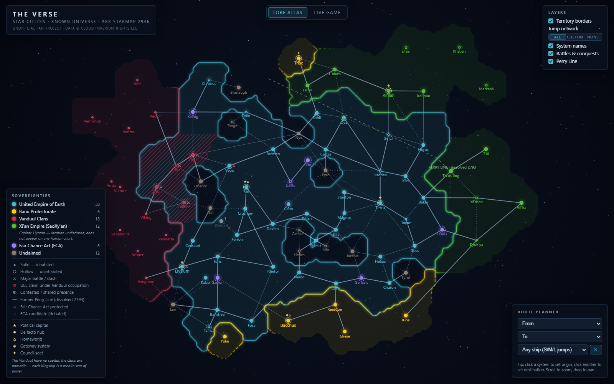

# The Verse — a grand-strategy-style map of the Star Citizen universe

An interactive, single-file starmap of the Star Citizen universe, drawn the way grand-strategy games draw galaxies: filled faction territories with glowing borders, a jump-point network rendered like hyperlanes, and the political geography of the 'verse visible at a glance.



**[▶ Open the live map](https://YOUR-USERNAME.github.io/YOUR-REPO/)** *(update this link after enabling GitHub Pages)*

## Features

The map has two modes. The default **Lore atlas** covers all 90 star systems of the ARK Starmap with their canonical lore coordinates and the full network of 130 jump tunnels. **Live game** strips the map down to what you can actually fly today — Stanton, Pyro, and Nyx as of Alpha 4.9, with their in-game jumps (including the non-canon Stanton–Nyx placeholder, flagged in hazard orange) and ghost stubs pointing toward canon jump routes that aren't built yet. Territory is computed from an influence field around each faction's systems, so borders emerge naturally between the UEE, the Vanduul clans, the Xi'an Empire, and the Banu Protectorate — while neutral pockets like Cathcart, Nyx, and Oberon carve enclaves out of imperial space, just like they should.

On top of the base map: a route planner (click two systems or use the dropdowns) that respects jump-point sizes — try Sol → Terra restricted to large ships and you'll get the canonical six-jump trade lane through Davien, Kilian, Ellis, Magnus, and Stanton. Battle and conquest markers tell the story of the Vanduul war: Orion (fell 2712), Tiber (2736), Virgil (2736), and Caliban (2884) carry "former UEE" rings, Vega wears its 2945 battle marker. The dissolved Perry Line runs as a dashed historic border through the eight transitional systems, Oya renders as a split UEE/Xi'an disc for the shared sovereignty of Oya III, and every system opens a lore card with population, economy, danger ratings, and the full ARK Starmap description. Fair Chance Act systems — developing worlds closed to expansion — get their own violet category and rings, including the FCA-protected but UEE-affiliated Cano and Tamsa, with fainter markers for the debated candidates Gurzil and Min; since the FCA is UEE law, these systems sit inside the blue border as protected enclaves rather than holes in the Empire. Every system also reads as inhabited (solid disc, bold label) or uninhabited (hollow ring) straight from its population data, and the four systems the Vanduul took from the UEE — Orion, Tiber, Virgil, Caliban — carry a candy-stripe occupation overlay marking them as UEE claims under Vanduul control. Jump lanes come in three unmistakable tiers (dotted small, thin medium, bold large — the Sol–Terra trade artery reads at a glance), capitals use a tiered glyph taxonomy that says exactly what each claim is (political capital, de facto hub, homeworld, gateway, council seat — the nomadic Vanduul get none), and lost Oretani hangs off the map's one severed lane, its only jump point collapsed in 2485. Frontier borders dissolve where they face uncharted space: only edges facing charted territory render solid, so the Xi'an Empire opens toward its own interior and the Vanduul frontier bleeds into the dark. Current Xi'an naming is applied throughout (Kai'pua, Th.us'ūng, Yā'mon, Kyuk'ya, La'uo, Ē'aluth, T.āl, Ail'ka).

Everything is one self-contained HTML file — no build step, no dependencies, no backend.

## Hosting it yourself

1. Fork or clone this repo (or just grab `index.html`).
2. In the repo settings, enable **Pages** → deploy from the `main` branch, root folder.
3. Your map is live at `https://<username>.github.io/<repo>/`.

## Development

`index.html` is generated — don't edit it directly. The source lives in `dev/`: `template.html` (page + rendering code) and `build_data.py` (transforms the raw ARK Starmap dump into compact map data and injects the lore annotations). Rebuild with:

```
python dev/build_data.py
```

## Data & lore sources

System positions, affiliations, and jump tunnels come from the public [ARK Starmap](https://robertsspaceindustries.com/starmap) data. Lore annotations (Perry Line, Vanduul conquests, system renames, Oya III) were cross-checked against the [Star Citizen Wiki](https://starcitizen.tools). Deviations from the official starmap are lore-driven overlays, not canon.

## How it was built

This map was built collaboratively with Claude (Anthropic), from lore research through implementation and testing — an experiment in AI-assisted development of community tools.

## Legal

This is an unofficial fan project, not affiliated with the Cloud Imperium group of companies. Star Citizen®, Roberts Space Industries® and Cloud Imperium® are registered trademarks of Cloud Imperium Rights LLC. All game data, names, and lore are © Cloud Imperium Rights LLC and Cloud Imperium Rights Ltd. The map code is released under the MIT License (see `LICENSE`).
